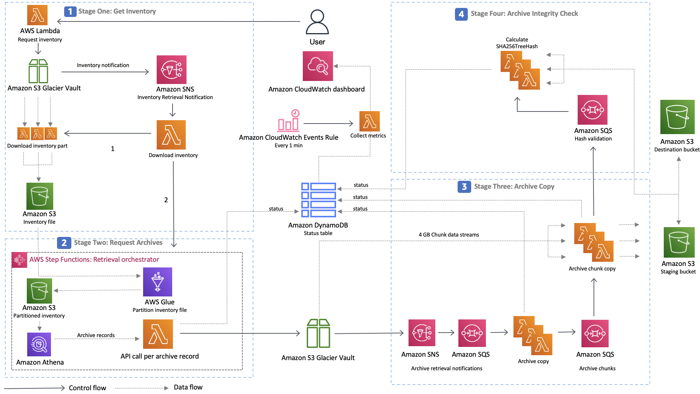
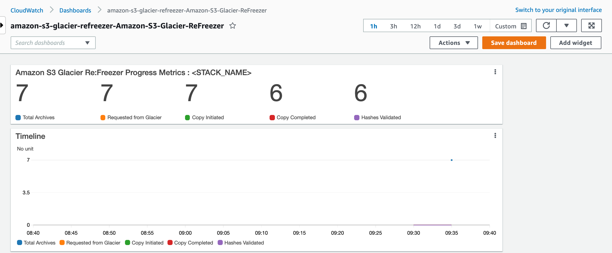

# Amazon S3 Glacier Re:Freezer 
The Amazon S3 Glacier Re:Freezer is a serverless solution that automatically copies entire Amazon S3 Glacier vault archives to a defined destination Amazon Simple Storage Service (Amazon S3 bucket) and S3 storage class.

The solution automates the optimized restore, copy, and transfer process and provides a prebuilt Amazon CloudWatch dashboard to visualize the copy operation progress. Deploying this solution allows you to seamlessly copy your S3 Glacier vault archives to more cost effective storage locations such as the Amazon S3 Glacier Deep Archive storage class.

Copying your Amazon S3 Glacier vault contents to the S3 Glacier Deep Archive storage class combines the low cost and high durability benefits of S3 Glacier Deep Archive, with the familiar Amazon S3 user and application experience that offers simple visibility and access to data. Once your archives are stored as objects in your Amazon S3 bucket, you can add tags to your data to enable items such as attributing data costs on a granular level.

Note: The solution only copies archives from a source S3 Glacier vault to the destination S3 bucket, it does not delete archives in the source S3 Glacier vault. After the solution completes a successful archive copy to the destination S3 bucket, you must manually delete the archives from your S3 Glacier vault.For more information,
refer to [Deleting an Archive in Amazon S3 Glacier](https://docs.aws.amazon.com/amazonglacier/latest/dev/deleting-an-archive.html) in the Amazon S3 Glacier Developer Guide.

## Table of contents
- [Architecture](#architecture)
- [Project structure](#project-structure)
- [Anonymous metric collection](#anonymous-metric-collection)
- [Deployment](#deployment)
- [Runtime Monitoring](#monitoring)
- [Creating a custom build](#creating-a-custom-build)
- [Additional Resources](#additional-resources)

## Architecture

Architecture:



The solution utilizes the following as inputs for deployment: 
- Source Amazon S3 Glacier Vault
- Amazon S3 Glacier Retrieval Tier
- Target Amazon S3 Bucket
- Target Amazon S3 Storage Class

### Stage One: Get Inventory

The solution obtains the latest Glacier vault inventory file 

**OBS! Inventory generation can take up to 4 hours.**

Once inventory has been generated by Glacier and the notification sent to the Inventory Notification Topic, a set of Lambda functions will download the latest inventory into the staging bucket and trigger Stage Two.

### Stage Two: Request Archives
The solution parses, partitions, and optimizes the Glacier vault inventory file, and then starts the optimized restore order request from Amazon S3 Glacier.

**OBS! Retrieval can take up to 8 hours for Standard Tier and 12 hours for Bulk.**

### Stage Three: Archive Copy

The solution begins the archive copy process to the staging Amazon S3 bucket and Amazon S3 Standard storage class. During the archive copy process, Amazon DynamoDB tracks the status of the archive copies and collects metrics visible in the provided Amazon CloudWatch dashboard.

If the archive is larger than 4GB, the solution calculates the number of the 4 GB chunks, opens a multipart upload request and submits each chunk as a separate request into a download-chunk-queue. Another asynchrnous lambda function will read from the queue, download each chunk, and, if the chunk has identified to be the last one through the DynamoDB status table, close off the multi part upload.

### Stage Four: Archive Integrity Check

The solution uses SHA256 Treehash to perform archive integrity checking on the copied object and match it with the SHA256 Treehash as recorded by Amazon S3 Glacier in the Glacier vault inventory list. After the SHA256 Treehash is validated, the object is moved from the staging S3 bucket to the destination S3 bucket and S3 storage class.

### State management and progress tracking

During the copy operation process, Amazon DynamoDB is used to keep track of the status of the archive copies, where the copy operation progress is visibile through the provided Amazon CloudWatch dashboard.

## Anonymous metric collection

This solution collects anonymous operational metrics to help AWS improve the quality of features of the solution. For more information, including how to disable this capability, please see the [implementation guide](https://docs.aws.amazon.com/solutions/latest/amazon-s3-glacier-refreezer/collection-of-operational-metrics.html).

The following data points are collected:

- Region 
- Target Storage Class
- Vault Archive Count
- Vault Size
- Solution version

## Deployment

> **Please ensure you test the solutions prior running it against any production vaults.**

The solution supports two deployment options:

### Option 1. Solution Builders Template

You can launch this solution with one click from the [solution home page](https://aws.amazon.com/solutions/implementations/amazon-s3-glacier-refreezer).

### Option 2. Custom Build

Please refer to [creating a custom build](#creating-a-custom-build) section below.

### Deployment Configuration 

The solution requires the following input parameters to be provided at CloudFromation stack deployment:

- Source Amazon S3 Glacier Vault
- Amazon S3 Glacier Retrieval Tier
- Target Amazon S3 Destination Bucket (should be pre-created before deployment)
- Target Amazon S3 Storage Class

Cost acknowledgements:
- Vault default SNS Topic confirmation <br>
  To confirm that there is no default notification topic configured. Or if there is one, it is OK to proceed with every archive retrieval API call resulting in an SNS notification.

- CloudTrail configuration confirmation <br>
  To confirm that there is only a single cloud trail export configured against the AWS account containing the source Glacier Vault. Glacier API calls are classified as management API calls and incur CloudTrail charges for each additional CloudTrail export configured in addition to the first one (which is free).

[Optional]:
- ArchiveDescription override filename location in the format: mybucket/myfile.csv
  The location of the file that provides ArchiveDescription override for the Vault archives. 

### Progress Tracking

Once deployed, the CloudFromation Output tab will have the link to Amazon CloudWatch progress dashboard - <STACK_NAME>-Amazon-S3-Glacier-ReFreezer.



## Project structure

```
├── deployment
│   └── cdk-solution-helper  [Lightweight helper that cleans-up synthesized templates from the CDK and removes Standard and Expedited options]
├── source
│   ├── bin                  [Entrypoint of the CDK application]
│   ├── images               [Assets referenced in the README file]
│   ├── lambda               [Lambda processing logic]
│   ├── lib                  [Constructs for the components of the solution]
│   └── test                 [Unit tests]
```

## Creating a custom build

To customize and deploy the solution from the source code, follow the steps below:

### Prerequisites

Install prerequisite software packages:

* [AWS Command Line Interface](https://aws.amazon.com/cli/)
* [AWS Cloud Development Kit (AWS CDK)](https://aws.amazon.com/cdk/)
* [Node package manager](https://www.npmjs.com/)
* Node.js 12.x or later

> **OBS**: At the time of writing the latest Node.js runtime version supported by AWS Lambda is v14 ([documentation](https://docs.aws.amazon.com/lambda/latest/dg/lambda-runtimes.html)). Please use Node.js v14 when running and testing the solution.

### 1. Download or clone this repo
```
git clone https://github.com/awslabs/amazon-s3-glacier-refreezer
```

### 2. Download NPM packages required for Lambda functions
```
cd ./source
chmod +x ./*.sh
./install-node-modules.sh
```

### 3. After introducing changes, run the unit tests to make sure the customizations don't break existing functionality

```
./run-all-tests.sh
```

### 4. Deploy the solution using CDK

Make sure AWS CLI is operational:

```
aws s3 ls
```

Bootstrap CDK, if required

```
cdk bootstrap
```

Deploy the solution.

Set environment variable GRF_STACK_NAME with the name of cloudformation stack. Replace my-stack-1 with a name of your choice.

```
export GRF_STACK_NAME=<<my-stack-1>>
```

Replace the parameter placeholders designated as <<>>. Provide name of the source glacier vault, name of the destination S3 bucket, the destination storage class (e.g. DEEP_ARCHIVE, STANDARD, etc.) and the optional parameter - Amazon S3 location where you have stored the mapping file.

```
cdk deploy  --parameters SourceVault=<<my-source-vault>>  \
            --parameters DestinationBucket=<<my-destination-bucket>> \
            --parameters DestinationStorageClass=DEEP_ARCHIVE \
            --parameters GlacierRetrievalTier=Bulk \
            --parameters CloudTrailExportConfirmation=Yes \
            --parameters SNSTopicForVaultConfirmation=Yes \
            --parameters FilelistS3Location=<<my-filelist-override-bucket/my-override-filename.csv>>
```

Leave FilelistS3Location (optional parameter) empty if you are not providing a mapping file. 

```
            --parameters FilelistS3Location=
```

### 5. Prepare Cloudformation Template

The solution expects the CloudFromation template to be uploaded into Amazon S3 Bucket named as:

    <BUCKET_BASE>-<REGION>

For example:

    my-glacier-refreezer-ap-southeast-2

To prepare the template:
```
cd ./deployment
chmod +x ./*.sh

BUCKET_BASE=my-glacier-refreezer   # S3 bucket name BASE 
                                   # i.e. without the region designator 
SOLUTION_NAME=my-solution-name     # custom solution name
VERSION=my-version                 # custom version number

./build-s3-dist.sh $BUCKET_BASE $SOLUTION_NAME $VERSION
```

### 6. Upload deployment assets to your Amazon S3 buckets

Create the CloudFormation bucket as defined above in the region you wish to deploy. 

The CloudFormation templates are configured to pull the Lambda deployment packages from Amazon S3 bucket in the region the template is being launched in.

```
aws s3 mb s3://$BUCKET_BASE-ap-southeast-2 --region ap-southeast-2
```

To upload the template to the regional bucket:

```
BUCKET_NAME=my-glacier-refreezer-ap-southeast-2    # full regional bucket name
SOLUTION_NAME=my-solution-name                     # custom solution name
VERSION=my-version                                 # custom version number

aws s3 cp ./global-s3-assets/   s3://${BUCKET_NAME}/${SOLUTION_NAME}/${VERSION} --recursive --acl public-read --acl bucket-owner-full-control
aws s3 cp ./regional-s3-assets/ s3://${BUCKET_NAME}/${SOLUTION_NAME}/${VERSION} --recursive --acl public-read --acl bucket-owner-full-control 

echo "https://${BUCKET_NAME}.s3.amazonaws.com/${SOLUTION_NAME}/${VERSION}/${SOLUTION_NAME}.template"
```

### 7. Launch the CloudFormation template

* Get the link of the template uploaded to your Amazon S3 bucket (created as $BUCKET_NAME in the previous step)
* Deploy the solution to your account by launching a new AWS CloudFormation stack

## Additional Resources

### Services
- [AWS DynamoDB](https://docs.aws.amazon.com/dynamodb/) - keeps track of the archive copy processing state and collects progress metrics.
- [Amazon Simple Notification Service](https://docs.aws.amazon.com/sns/) (Amazon SNS) — communicates with the Amazon S3 Glacier service.
- [Amazon Simple Queue Service](https://docs.aws.amazon.com/sqs/) (Amazon SQS) — decouples Lambda steps.
- [Amazon CloudWatch](https://docs.aws.amazon.com/cloudwatch/) — stores the solution logs and metrics, and presents a custom dashboard to enable visibility of the archive copy operation progress and any encountered errors.
- [Amazon Athena](https://docs.aws.amazon.com/athena/) — queries against your Glacier vault inventory list.
- [AWS Glue](https://docs.aws.amazon.com/glue/) — reorders and splits the Amazon S3 Glacier vault inventory file into partitions to be processed by multiple AWS Lambda invocations.
- [AWS Step Functions](https://docs.aws.amazon.com/step-functions/) — orchestrate partitioning the inventory with AWS Glue, updating the total archive count in DynamoDB table, uploading anonymous statistics, and AWS Lambda invocations to request Glacier vault archives retrieval.
- [Amazon S3](https://docs.aws.amazon.com/s3/) — creates an Amazon S3 bucket for the staging area to temporarily store the copied S3 Glacier vault archives.
- [AWS Lambda](https://docs.aws.amazon.com/lambda/) - 1) request and download the inventory file for the Amazon S3 Glacier vault, 2) request archives from Amazon S3 Glacier vault, 3) perform the archive copy function to the staging Amazon S3 bucket, 4) calculate SHA256 Treehash of copied objects, 5) move the validated objects to the destination Amazon S3 bucket, 6) collect and post metrics to Amazon CloudWatch, and 7) send anonymous statistics to the Solution Builder endpoint (if you elect to send anonymous statistics).

***

Copyright 2021 Amazon.com, Inc. or its affiliates. All Rights Reserved.

Licensed under the Apache License, Version 2.0 (the "License");
you may not use this file except in compliance with the License.
You may obtain a copy of the License at

    http://www.apache.org/licenses/LICENSE-2.0

Unless required by applicable law or agreed to in writing, software
distributed under the License is distributed on an "AS IS" BASIS,
WITHOUT WARRANTIES OR CONDITIONS OF ANY KIND, either express or implied.
See the License for the specific language governing permissions and
limitations under the License.
